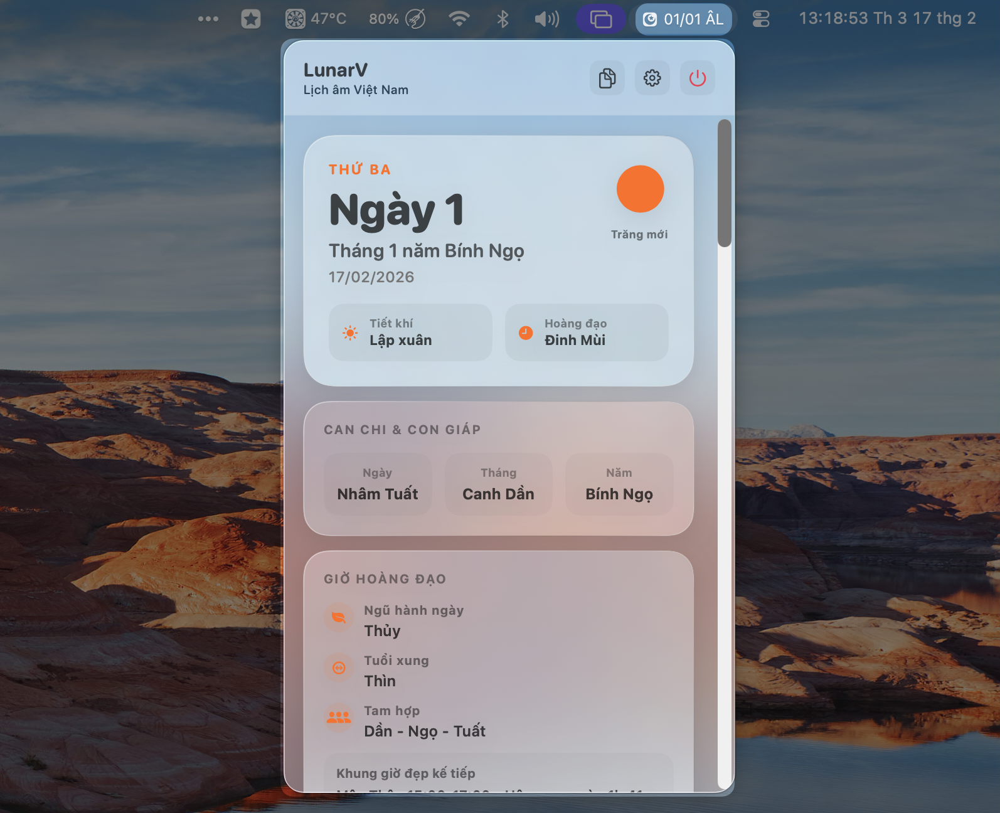
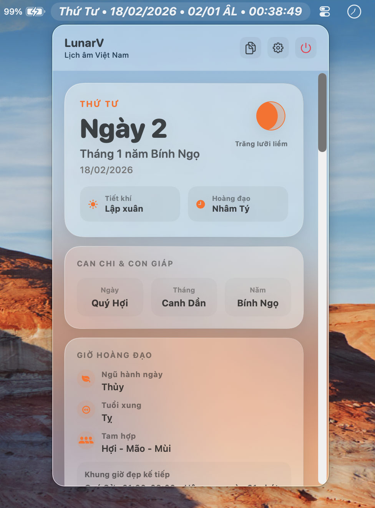

<p align="center">
  
</p>

<h1 align="center">LunarV</h1>
<p align="center"><strong>Lịch Âm Việt Nam trên thanh menu macOS</strong></p>

<p align="center">
  Ứng dụng hiển thị ngày âm lịch theo thời gian thực, kèm thông tin lịch Việt Nam chuyên sâu
  và widget tiện theo dõi trên Desktop/Notification Center.
</p>

## Mục lục

- [Tổng quan](#tổng-quan)
- [Tính năng](#tính-năng)
- [Ảnh giao diện](#ảnh-giao-diện)
- [Yêu cầu hệ thống](#yêu-cầu-hệ-thống)
- [Cài đặt](#cài-đặt)
- [Build từ mã nguồn](#build-từ-mã-nguồn)
- [Công nghệ sử dụng](#công-nghệ-sử-dụng)
- [Cấu trúc dự án](#cấu-trúc-dự-án)
- [Độ chính xác dữ liệu](#độ-chính-xác-dữ-liệu)
- [Đóng góp](#đóng-góp)
- [Nhật ký thay đổi](#nhật-ký-thay-đổi)
- [Giấy phép](#giấy-phép)

## Tổng quan

LunarV là ứng dụng macOS giúp bạn xem **lịch âm Việt Nam** nhanh ngay trên thanh menu.
Ứng dụng tập trung vào:

- Hiển thị gọn, cập nhật tự động.
- Thông tin lịch Việt Nam đầy đủ và dễ tra cứu.
- Giao diện macOS thuần, nhất quán với hệ thống.

## Tính năng

### Thanh menu

- Hiển thị ngày âm lịch trực tiếp trên menu bar.
- Tự động cập nhật theo thời gian thực.

### Thông tin lịch Việt Nam chi tiết

- Can Chi theo ngày, tháng, năm.
- Tiết khí, con giáp.
- Giờ hoàng đạo (Can Chi theo giờ).
- Ngũ hành ngày, tuổi xung, nhóm tam hợp.
- Trực ngày (Thập nhị kiến trừ) kèm gợi ý nên làm/nên tránh.
- Gợi ý hoạt động theo ngũ hành ngày và mùa tiết khí.
- Chỉ số ngày (0-100) và ma trận mức độ thuận lợi theo nhóm hoạt động.

### Hiển thị và trải nghiệm

- Lưới tháng hiển thị song song ngày dương/ngày âm.
- Widget cho Desktop và Notification Center.
- UI thuần macOS với `MenuBarExtra`, `NSVisualEffectView` và semantic colors.

### Cơ chế tự làm mới

Ứng dụng tự đồng bộ dữ liệu khi:

- Sang phút mới.
- Thay đổi đồng hồ hệ thống.
- Thay đổi múi giờ.
- Sang ngày mới.
- Máy thức dậy từ chế độ ngủ.

## Ảnh giao diện

<p align="center">
  
  
</p>

## Yêu cầu hệ thống

- macOS 15.0 trở lên.
- Chip Apple Silicon hoặc Intel.

## Cài đặt

### Cách 1: Dùng bản phát hành (`.dmg`)

1. Tải file `.dmg` mới nhất tại [Releases](../../releases/latest).
2. Mở file DMG.
3. Kéo **LunarV** vào thư mục **Applications**.

### Cách 2: Chạy trực tiếp bằng Xcode

1. Mở `LunarV.xcodeproj`.
2. Chọn scheme `LunarV`.
3. Nhấn `Run` (`⌘R`).

## Build từ mã nguồn

Build bản `Release` bằng dòng lệnh:

```bash
xcodebuild \
  -project LunarV.xcodeproj \
  -scheme LunarV \
  -configuration Release \
  -sdk macosx \
  build
```

## Công nghệ sử dụng

| Thành phần | Chi tiết |
| --- | --- |
| Ngôn ngữ | Swift 5 |
| UI | SwiftUI (macOS) |
| Widget | WidgetKit |
| Kiến trúc | MVVM |
| Build system | Xcode (`.xcodeproj`) |

## Cấu trúc dự án

```text
LunarV/
├── App/                      # Điểm khởi chạy ứng dụng
├── Core/
│   ├── LunarCalendar/
│   │   ├── Algorithms/       # Thuật toán chuyển đổi âm lịch
│   │   ├── Models/           # Mô hình dữ liệu
│   │   └── Services/         # Dịch vụ cung cấp ngày âm lịch
│   ├── MenuBar/              # Định dạng tiêu đề thanh menu
│   ├── Settings/             # Cài đặt ứng dụng
│   └── System/               # Khởi động cùng hệ thống
├── Features/
│   ├── MenuBar/              # Giao diện + logic thanh menu
│   └── Settings/             # Giao diện cài đặt
└── LunarVWidget/             # Widget Extension
```

## Độ chính xác dữ liệu

Phép chuyển đổi âm lịch dùng múi giờ Việt Nam: `Asia/Ho_Chi_Minh` (`UTC+7`).
Điều này giúp kết quả nhất quán với lịch âm Việt Nam trong thực tế.

## Đóng góp

Đọc [CONTRIBUTING.md](CONTRIBUTING.md) trước khi tạo Pull Request.

## Nhật ký thay đổi

Xem lịch sử phát triển tại [CHANGELOG.md](CHANGELOG.md).

## Giấy phép

Dự án được phân phối theo giấy phép **GNU Affero General Public License v3.0 (AGPL-3.0-only)**.
Chi tiết tại [LICENSE](LICENSE).
